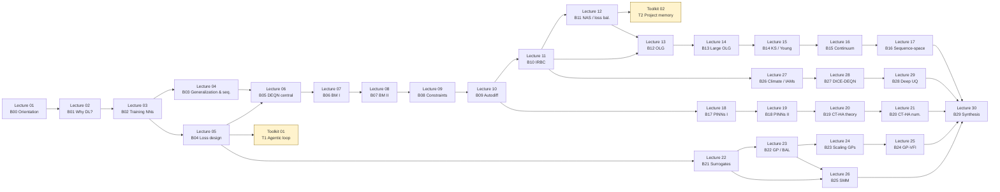

# Course map

A detailed walk-through of the 30-lecture sequence and the 2-toolkit track.
This file is generated from `course.yml`; regenerate after edits there.

> **For the public README portal, see [`README.md`](README.md). For the
> chapter-based companion text, see [`lecture_script/lecture_script.pdf`](lecture_script/lecture_script.pdf).**

## Conventions

- **Lecture label** (`Lecture XX`): student-facing; this is how lectures
  are referenced everywhere outside the script.
- **Block ID** (`BYY`): canonical lecture identifier used in
  `course.yml`, the script's lecture-index, and validation scripts. Block
  IDs are stable across renumbering.
- **Toolkit blocks** (`T1`, `T2`): cross-cutting research-workflow
  modules. Not part of the lecture script. Strongly recommended even for
  readers on the Core DEQN path.
- **Compute tier** — `cpu-light` (laptop, minutes), `cpu-standard`
  (laptop, tens of minutes), `gpu-recommended` (a few minutes on GPU,
  longer on CPU; smoke mode runs on CPU), `gpu-required` (CPU does not
  finish in a reasonable time).
- **Time budget** — `short` (≤ 1 h with hands-on), `standard` (~ 2-3 h),
  `long` (half-day or more).

## Course-flow diagram



## At-a-glance table

| # | Block | Title | Compute | Time | Prereqs |
|---:|---|---|---|---|---|
| 01 | B00 | Orientation, setup, reproducibility | cpu-light | short | — |
| 02 | B01 | Why deep learning? | cpu-light | standard | B00 |
| 03 | B02 | Training neural networks | cpu-standard | standard | B01 |
| 04 | B03 | Generalization and sequence models | cpu-standard | standard | B02 |
| 05 | B04 | Function approximation and loss design | cpu-standard | standard | B02 |
| **T1** | **T1** | **Toolkit: agentic research-coding loop** | **cpu-light** | **standard** | **B04** |
| 06 | B05 | DEQN — the central idea | cpu-light | standard | B04 |
| 07 | B06 | Brock-Mirman I (deterministic) | cpu-standard | standard | B05 |
| 08 | B07 | Brock-Mirman II (uncertainty) | cpu-standard | standard | B06 |
| 09 | B08 | Constraints, residual kernels, loss design | cpu-standard | standard | B07 |
| 10 | B09 | Autodiff for DEQNs | cpu-standard | standard | B08 |
| 11 | B10 | IRBC with DEQNs | gpu-recommended | long | B09 |
| 12 | B11 | NAS and loss balancing | gpu-recommended | long | B10 |
| **T2** | **T2** | **Toolkit: project memory, agents, hooks** | **cpu-light** | **standard** | **B11** |
| 13 | B12 | OLG with DEQNs | cpu-standard | standard | B10 |
| 14 | B13 | Large OLG benchmark | gpu-recommended | long | B12 |
| 15 | B14 | Krusell-Smith and Young's method | cpu-standard | standard | B13 |
| 16 | B15 | Continuum-of-agents DEQN | gpu-recommended | long | B14 |
| 17 | B16 | Sequence-space DEQNs | gpu-recommended | long | B15 |
| 18 | B17 | PINNs I — ODEs and PDEs | cpu-standard | standard | B09 |
| 19 | B18 | PINNs II — economic PDEs | cpu-standard | standard | B17 |
| 20 | B19 | Continuous-time HA theory | cpu-light | standard | B18 |
| 21 | B20 | Continuous-time HA numerics | gpu-recommended | long | B19 |
| 22 | B21 | Deep surrogate models | cpu-standard | standard | B04 |
| 23 | B22 | Gaussian processes and BAL | cpu-standard | standard | B21 |
| 24 | B23 | Scaling GPs — active subspaces, deep kernels | gpu-recommended | long | B22 |
| 25 | B24 | GPs for dynamic programming | cpu-standard | long | B23 |
| 26 | B25 | Structural estimation via SMM | cpu-standard | long | B22 |
| 27 | B26 | Climate economics and IAMs | cpu-light | standard | B10 |
| 28 | B27 | Solving DICE with DEQNs | gpu-recommended | long | B26 |
| 29 | B28 | Deep uncertainty quantification and policy | gpu-recommended | long | B27 |
| 30 | B29 | Synthesis and method choice | cpu-light | short | B28 |

## Recommended learning paths

### Complete path (recommended for self-study)

Includes both toolkits as essential modules.

```
Lecture 01 → 02 → 03 → 04 → 05 → Toolkit 01
   → 06 → 07 → 08 → 09 → 10 → 11 → 12 → Toolkit 02
   → 13 → 14 → 15 → 16 → 17 → 18 → 19 → 20 → 21
   → 22 → 23 → 24 → 25 → 26 → 27 → 28 → 29 → 30
```

### Core DEQN path

```
01 → 02 → 03 → 05 → 06 → 07 → 08 → 09 → 10 → 11 → 12
   → 13 → 14 → 15 → 16 → 30
```

### Heterogeneous-agent path

```
01 → 06 → 07 → 08 → 10 → 13 → 14 → 15 → 16 → 17
   → 20 → 21 → 30
```

### Continuous-time / PINN path

```
01 → 02 → 03 → 10 → 18 → 19 → 20 → 21 → 30
```

### Surrogates, GPs, and estimation path

```
01 → 02 → 03 → 05 → 22 → 23 → 24 → 25 → 26 → 30
```

### Climate and deep-UQ path

```
01 → 06 → 07 → 08 → 11 → 22 → 23 → 27 → 28 → 29 → 30
```

### Toolkit-only path (research workflow training)

```
Toolkit 01 → Toolkit 02
```

## Decision guide for method choice

| Problem feature | Recommended method | Lectures |
|---|---|---|
| Recursive equilibrium with explicit Euler residuals | DEQN | 06-17 |
| ODE/PDE in time or in a low-D state space | PINN | 18-21 |
| Expensive simulator that must be queried often | Deep surrogate | 22, 26, 28-29 |
| Smooth low/medium-D function with uncertainty quantification | Gaussian process | 23-25 |
| Continuous-time heterogeneous agents (HJB + KFE) | PINN or finite difference | 20-21 |
| Structural estimation with implicit moments | Surrogate-based SMM | 26 |
| Long-horizon climate-economy with deep uncertainty | DEQN + deep UQ + GP | 27-29 |

## Compute and reproducibility notes

- Every notebook exposes `RUN_MODE = "smoke" | "teaching" | "production"`
  and `SEED = 0` at the top. Smoke mode bounds epochs/batch/sample size
  for CI and for low-spec laptops; teaching mode produces
  classroom-quality figures; production mode reproduces high-quality
  results and may require GPU.
- The course platform of record (Nuvolos Cloud) ships all dependencies
  pre-installed. Self-study readers can reproduce the environment via
  `requirements.txt` or `environment.yml`.
- Notebooks were *not* re-executed during the public migration; outputs
  are preserved as-is from the live-course repository. The validation
  harness (`scripts/run_all_smoke_tests.py`) is the only place where
  notebooks are re-executed.

## Maintenance

`course.yml` is the canonical source of truth. After editing `course.yml`,
regenerate this file. The validation suite checks that
`course.yml`, `COURSE_MAP.md`, and `README.md` agree on lecture
sequence and prerequisites.
