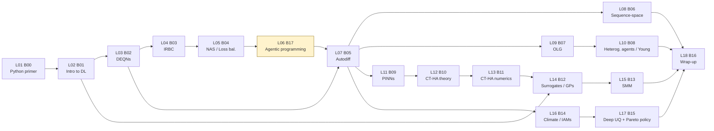

# Course map

A walk-through of the 18-lecture sequence.

> For the public README portal, see [`README.md`](README.md). For the chapter-based companion text, see [`lecture_script/Deep_Learning_for_Solving_And_Estimating_Dynamic_Economic_Models.pdf`](lecture_script/Deep_Learning_for_Solving_And_Estimating_Dynamic_Economic_Models.pdf).

## Conventions

- **Lecture label** (`Lecture XX`): student-facing identifier.
- **Block ID** (`BYY`): canonical lecture identifier shared with the lecture script's lecture index. Block IDs are stable across renumbering.
- **Compute tier**: `cpu-light` (laptop, minutes), `cpu-standard` (laptop, tens of minutes), `gpu-recommended` (a few minutes on GPU, longer on CPU; smoke mode runs on CPU), `gpu-required` (CPU does not finish in a reasonable time).
- **Time budget**: `short` (≤ 1 h with hands-on), `standard` (~ 2-3 h), `long` (half-day or more).

## Course-flow diagram



## At-a-glance table

| # | Block | Title | Compute | Time | Prereqs |
|---:|---|---|---|---|---|
| 01 | B00 | Python primer | cpu-light | short | — |
| 02 | B01 | Introduction to deep learning | cpu-standard | long | B00 |
| 03 | B02 | Deep Equilibrium Nets | cpu-standard | long | B01 |
| 04 | B03 | IRBC with DEQNs | gpu-recommended | long | B02 |
| 05 | B04 | Architecture search and loss balancing | gpu-recommended | long | B03 |
| **06** | **B17** | **Agentic programming** | **cpu-light** | **long** | **B04** |
| 07 | B05 | Automatic differentiation for DEQNs | cpu-standard | standard | B02 |
| 08 | B06 | Sequence-space DEQNs | gpu-recommended | long | B05 |
| 09 | B07 | OLG models with DEQNs | gpu-recommended | long | B05 |
| 10 | B08 | Heterogeneous agents and Young's method | gpu-recommended | long | B07 |
| 11 | B09 | Physics-informed neural networks | cpu-standard | long | B05 |
| 12 | B10 | Continuous-time HA, theory | cpu-light | standard | B09 |
| 13 | B11 | Continuous-time HA, numerics | gpu-recommended | long | B10 |
| 14 | B12 | Surrogates and Gaussian processes | gpu-recommended | long | B01 |
| 15 | B13 | Structural estimation via SMM | cpu-standard | long | B12 |
| 16 | B14 | Climate economics and IAMs | gpu-recommended | long | B05 |
| 17 | B15 | Deep UQ and Pareto-improving climate policy | gpu-recommended | long | B14 |
| 18 | B16 | Course wrap-up | cpu-light | short | B15 |

## Recommended learning paths

### Complete path (self-study)

```
L01 → L02 → L03 → L04 → L05 → L06 (agentic programming)
   → L07 → L08 → L09 → L10 → L11 → L12 → L13
   → L14 → L15 → L16 → L17 → L18
```

### Core DEQN path

```
L01 → L02 → L03 → L04 → L05 → L07 → L08 → L09 → L10 → L18
```

### Continuous-time / PINN path

```
L01 → L02 → L03 → L07 → L11 → L12 → L13 → L18
```

### Surrogates, GPs, and estimation path

```
L01 → L02 → L14 → L15 → L18
```

### Climate and deep-UQ path

```
L01 → L02 → L03 → L07 → L14 → L16 → L17 → L18
```

## Decision guide for method choice

| Problem feature | Recommended method | Lectures |
|---|---|---|
| Recursive equilibrium with explicit Euler residuals | DEQN | L03–L10 |
| ODE/PDE in time or in a low-D state space | PINN | L11–L13 |
| Expensive simulator that must be queried often | Deep surrogate | L14, L15, L17 |
| Smooth low/medium-D function with uncertainty quantification | Gaussian process | L14 |
| Continuous-time heterogeneous agents (HJB + KFE) | PINN or finite difference | L12–L13 |
| Structural estimation with implicit moments | Surrogate-based SMM | L15 |
| Long-horizon climate-economy with deep uncertainty | DEQN + deep UQ + GP | L16, L17 |

## Compute and reproducibility notes

- Every notebook exposes `RUN_MODE = "smoke" | "teaching" | "production"` and `SEED = 0` at the top. Smoke mode bounds epochs, batch size, and sample size for low-spec laptops; teaching mode produces classroom-quality figures; production mode reproduces high-quality results and may require GPU.
- Reproduce the environment via `requirements.txt` or `environment.yml`.
- Notebook outputs are preserved as published; no re-execution is needed to read along.
