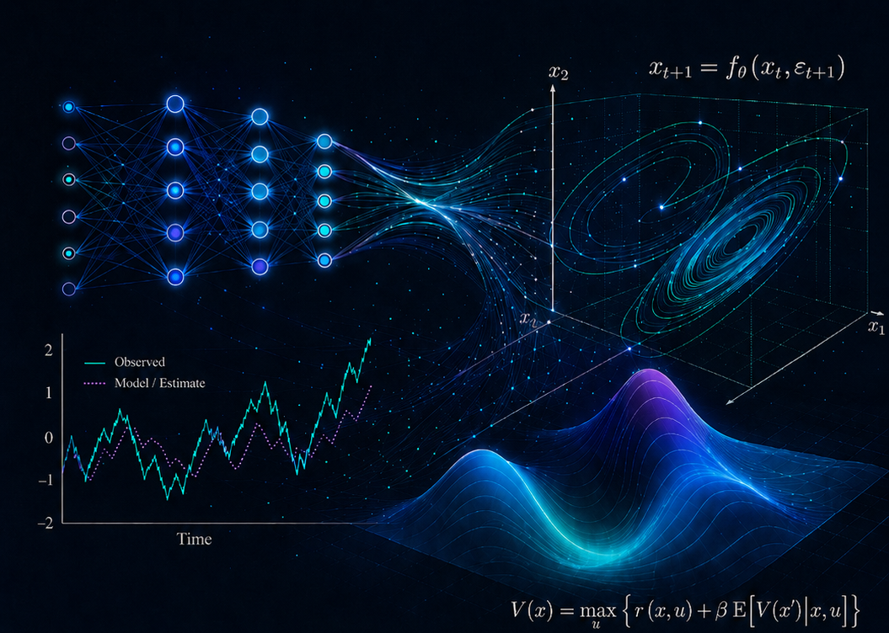

# Deep Learning for Solving and Estimating Dynamic Models in Economics and Finance

<p align="center">
  
</p>

> **Welcome.** This is a free, self-paced graduate course for PhD
> students and researchers in **computational and quantitative
> economics and finance** who want to use modern deep learning to
> solve and estimate the kinds of dynamic stochastic models that
> appear in macro, finance, and climate economics.
>
> Everything you need is in this repository: a textbook-length
> [lecture script](lecture_script/lecture_script.pdf), 30 paired
> lectures (slides + runnable Jupyter notebooks + exercises), a
> 2-module toolkit on using AI coding agents as research partners,
> and a curated bibliography. Work through it in your own order, at
> your own pace.

## What you will learn

This course teaches a coherent set of deep-learning methods for the
recursive, stochastic, often high-dimensional models that show up in
modern macroeconomics, asset pricing, and climate-economic policy work.
Five capabilities, each motivated below.

### 1. Solving recursive equilibrium models with neural networks

Most quantitative macro models reduce to functional equations — Euler
equations, Bellman equations, market-clearing conditions — that
classical methods (projection, value-function iteration, perturbation)
struggle with once the state space gets large or the policy is
nonsmooth. **Deep Equilibrium Nets (DEQNs)** parameterize the policy
or value function with a neural network and minimize the
equilibrium-equation residuals directly via stochastic gradient descent,
sidestepping a curse-of-dimensionality grid. The companion **Physics-Informed
Neural Networks (PINNs)** do the same for continuous-time models: the
loss is the residual of a Hamilton–Jacobi–Bellman equation, automatic
differentiation supplies the derivatives, and there is no mesh.
You will build both end-to-end on benchmarks where the answer is known
(Brock–Mirman, cake-eating, Black–Scholes) and then on models where it
isn't (IRBC, OLG with 56 cohorts, Krusell–Smith with a continuum of
agents, continuous-time heterogeneous agents).

### 2. Surrogates, Gaussian processes, and Bayesian active learning

Many calibration, estimation, and policy-evaluation tasks call the
underlying model thousands or millions of times. A **deep surrogate
model** replaces that expensive call with a cheap, differentiable
neural network trained on a few hundred or thousand simulator outputs.
A **Gaussian process (GP)** does the same with built-in uncertainty
quantification, which lets **Bayesian active learning (BAL)** pick the
next training point optimally instead of throwing samples at a
hypercube. We then push GPs to high dimension via **active subspaces**
and **deep kernel learning**, and use them inside value-function
iteration (ASGP-VFI) as a competitor to DEQNs.

### 3. Structural estimation via simulated method of moments

Once a deep surrogate is in place, **simulated method of moments
(SMM)** estimation becomes a small optimization over the surrogate
rather than a brutal repeated re-solve of the structural model. You
will run single- and joint-parameter SMM on a deep surrogate of
Brock–Mirman and see how the estimator behaves under realistic noise
and identification challenges.

### 4. Deep uncertainty quantification for climate-economic policy

Integrated assessment models (DICE, CDICE) carry parameters whose
true values are deeply uncertain — equilibrium climate sensitivity is
the textbook example. Plugging point estimates in and reading off a
single social cost of carbon is misleading. We solve a stochastic IAM
with DEQNs under Epstein–Zin preferences, build GP surrogates for the
quantities of interest with BAL, run global sensitivity analysis
(Sobol, Shapley), and design **constrained Pareto-improving carbon-tax
policies** that respect the deep uncertainty rather than averaging it
away.

### 5. An AI-assisted research-coding workflow

Modern empirical and computational economics benefits enormously from
using AI coding agents (Claude Code) as research partners — but only
when the workflow is set up deliberately. The two toolkit modules
teach the orientation, prompt patterns, project memory (`CLAUDE.md`),
custom skills, subagents, and hooks that turn an LLM from a clever
autocomplete into a real research collaborator. T1 covers the
day-to-day interaction loop; T2 covers the operational scaffolding
that makes the workflow sustainable on a multi-month project.

## How to use this course

Pick whichever entry point fits your goal:

- 🚀 **I want a guided start.** Open
  [Lecture 01](lectures/lecture_01_B00_orientation_setup_reproducibility/README.md)
  and follow the **Complete path** in [`COURSE_MAP.md`](COURSE_MAP.md).
  This walks through all 30 lectures and weaves in both toolkits at
  their natural insertion points.
- 🎯 **I have a specific topic in mind.** Use the **topic index**
  below to jump straight to the relevant block.
- 🧪 **I want the research-workflow training first.** Start with the
  [agentic-programming toolkit](toolkit/toolkit_01_T1_agentic_research_coding_loop/README.md),
  then return to the lecture sequence.
- 📖 **I want a textbook.** Read the chapter-based
  [companion script](lecture_script/lecture_script.pdf); each chapter
  links to one or more lectures via
  [`script_to_lectures.md`](lecture_script/script_to_lectures.md).

For each lecture, the workflow is the same:

1. read the relevant chapter or section of the script;
2. step through the lecture's slide deck (under `slides/`);
3. run the **core** notebooks (under `notebooks/core/`);
4. attempt the **exercise** notebooks, then check the **solutions**;
5. optionally explore the **extensions** for advanced material.

Every long-running notebook exposes a `RUN_MODE = "smoke" | "full"` switch
at the top so you can run it on a CPU laptop in minutes (smoke mode, for a sanity
check) or take it all the way for the published-figure quality result.

## Topic index — find what you want

| If you want to learn… | Read | Notebooks |
|---|---|---|
| **Deep-learning fundamentals** (training, generalization, sequence models) | [Lectures 02–05](lectures/lecture_02_B01_why_deep_learning/README.md) | MLP / LSTM / Transformer on Edgeworth cycles, double descent, Genz approximations |
| **Deep Equilibrium Nets (DEQNs)** — the central method | [Lectures 06–10](lectures/lecture_06_B05_deqn_central_idea/README.md) | Brock-Mirman (deterministic, stochastic), Fischer-Burmeister constraints, autodiff |
| **Large-scale nonlinear DSGE** (IRBC) | [Lecture 11](lectures/lecture_11_B10_irbc_with_deqns/README.md) | International real business cycle with DEQNs |
| **Architecture search & loss balancing** (NAS, ReLoBRaLo) | [Lecture 12](lectures/lecture_12_B11_architecture_search_loss_balancing/README.md) | Random search, Hyperband, ReLoBRaLo / SoftAdapt / GradNorm |
| **OLG and heterogeneous agents** (discrete time) | [Lectures 13–17](lectures/lecture_13_B12_olg_models_deqns/README.md) | OLG, Krusell-Smith, Young's method, continuum-of-agents DEQN, sequence-space DEQNs |
| **PINNs and continuous-time HA** | [Lectures 18–21](lectures/lecture_18_B17_pinn_foundations/README.md) | ODE / PDE PINNs, hard vs soft BCs, cake-eating HJB, Black-Scholes PINN, continuous-time Aiyagari |
| **Surrogates, Gaussian processes, deep kernels** | [Lectures 22–25](lectures/lecture_22_B21_deep_surrogate_models/README.md) | Surrogate primer, GP regression + BAL, active subspaces, deep kernel learning, GP-VFI |
| **Structural estimation via SMM** | [Lecture 26](lectures/lecture_26_B25_structural_estimation_smm/README.md) | Brock-Mirman SMM (single- and joint-parameter) on a deep surrogate |
| **Climate economics, IAMs, and deep UQ** | [Lectures 27–29](lectures/lecture_27_B26_climate_economics_iams/README.md) | DICE / CDICE simulation, deterministic and stochastic CDICE-DEQN, deep UQ, optimal carbon-tax design |
| **Synthesis — when to use which method** | [Lecture 30](lectures/lecture_30_B29_synthesis_method_choice/README.md) | Decision guide and outlook |
| **Agentic research-coding workflow** | [Toolkit T1](toolkit/toolkit_01_T1_agentic_research_coding_loop/README.md) | AI-coding mental models, prompt engineering, the core interaction loop |
| **Project memory, custom skills, subagents, hooks** | [Toolkit T2](toolkit/toolkit_02_T2_project_memory_agents_hooks/README.md) | CLAUDE.md, skills, subagents, hooks, data-to-paper pipelines |

For the full table including compute and time budgets, prerequisites,
and the visual prerequisite diagram, see
[`COURSE_MAP.md`](COURSE_MAP.md).

## Toolkit modules — first-class, not optional

The two toolkits live alongside the lectures and teach the
**research workflow** that makes the rest of the course tractable for
real projects. Both can be done as standalone modules.

| Toolkit | Folder | Recommended placement |
|---|---|---|
| **T1 — Agentic research-coding loop** | [`toolkit/toolkit_01_T1_*/`](toolkit/toolkit_01_T1_agentic_research_coding_loop/README.md) | After Lecture 05, before starting DEQN work |
| **T2 — Project memory, agents, and hooks** | [`toolkit/toolkit_02_T2_*/`](toolkit/toolkit_02_T2_project_memory_agents_hooks/README.md) | After Lecture 12, before the heterogeneous-agent block |

## Setup

Notebooks run on **Python 3.10+**. Two reproducible setups:

```bash
# pip
pip install -r requirements.txt

# conda
conda env create -f environment.yml
conda activate dlef
```

Main dependencies: NumPy / SciPy / pandas / Matplotlib / scikit-learn,
TensorFlow ≥ 2.15, PyTorch ≥ 2.0, JAX (selected notebooks), GPyTorch /
BoTorch (Lectures 23–25).

## Repository at a glance

```
.
├── README.md             ← you are here
├── COURSE_MAP.md         ← detailed map, learning paths, prerequisite diagram
├── course.yml            ← machine-readable course manifest
├── lectures/             ← 30 lecture folders (lecture_XX_BYY_*)
│   └── lecture_*/
│       ├── README.md         lecture index
│       ├── slides/           PDFs (and .tex sources)
│       ├── notebooks/
│       │   ├── core/         walkthroughs
│       │   ├── exercises/    blanks
│       │   ├── solutions/    filled-in
│       │   └── extensions/   advanced
│       ├── code/             auxiliary modules
│       ├── figures/          generated and static figures
│       └── notes/            short lecture-specific notes
├── toolkit/              ← Toolkit T1 and T2
├── lecture_script/       ← textbook-length companion script
├── readings/             ← per-lecture link guides + bibliography.bib
├── src/dlef/             ← reusable teaching package
├── assets/               ← hero figure, generated figures, attributions
├── data/                 ← generated datasets
├── scripts/              ← validation, build, and smoke-test scripts
└── legacy/               ← historical (live-course) timetable
```

## Glossary

The script's Appendix A is the canonical glossary. A grep-able copy
lives at [`lecture_script/glossary.md`](lecture_script/glossary.md).

## Readings and copyright

Most readings are journal articles, working papers, or copyrighted
books. The public repository **links** to publishers, DOIs, arXiv, or
author pages rather than redistributing PDFs. Per-lecture link guides
live under
[`readings/links_by_lecture/`](readings/links_by_lecture/);
the full bibliography is in
[`readings/bibliography.bib`](readings/bibliography.bib).

## License and citation

- **Code:** [MIT](LICENSE)
- **Text, slides, script, figures:** [CC0 1.0 Universal](LICENSE-content.md)
- **Third-party material:** see [`NOTICE.md`](NOTICE.md) and
  [`assets/attributions.yml`](assets/attributions.yml)
- **Citation:** [`CITATION.cff`](CITATION.cff)

Course author: **Simon Scheidegger** (University of Lausanne).

## Errata, contributions, and contact

Questions, corrections, and pull requests are welcome on
[GitHub](https://github.com/sischei/Deep_Learning_for_Solving_And_Estimating_Dynamic_Economic_Models).
By contributing you agree that your contribution is licensed under the
same terms as this repository.
