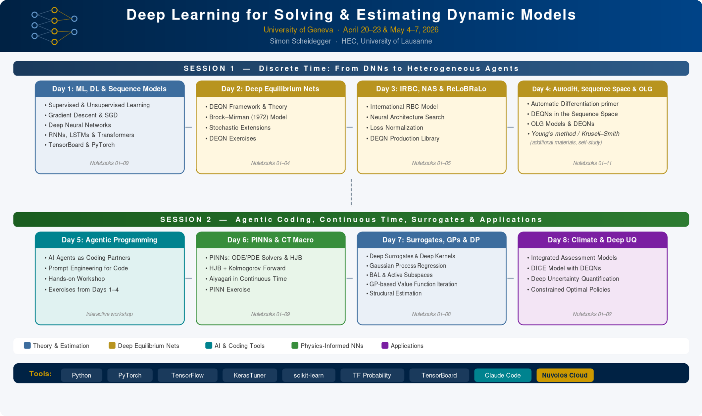

# Deep Learning for Solving and Estimating Dynamic Models in Economics and Finance

<p align="center">
  
</p>

An open-source, self-paced course for **PhD students in computational and
quantitative economics and finance**. The course covers deep learning
methods for solving and estimating dynamic stochastic models: Deep
Equilibrium Nets (DEQNs), physics-informed neural networks (PINNs),
Gaussian processes, deep surrogate models, structural estimation via
SMM, and deep uncertainty quantification with applications to climate
economics.

The materials are organised as a **30-lecture self-study sequence** plus
a **2-module agentic-research toolkit**.

## Start here

- **What this course is.** A graduate-level introduction to deep
  learning for dynamic economic and financial models. The course is
  built around a comprehensive [companion lecture script](lecture_script/lecture_script.pdf)
  and a sequence of paired slide decks and Jupyter notebooks.
- **Who it is for.** PhD students and researchers in computational
  economics, quantitative finance, macroeconomics, and adjacent fields.
- **How to use it.** Pick a learning path in
  [`COURSE_MAP.md`](COURSE_MAP.md). Read the relevant chapter of the
  script, walk through the slides, and run the notebooks. Each lecture
  folder has its own `README.md` listing slides, core notebooks,
  exercises, solutions, extensions, and readings.



## Toolkit modules — research-workflow training

These two cross-cutting modules teach how to use AI coding agents
(Claude Code) as research partners. They are **first-class** modules of
the course, even though they are not part of the chapter-based lecture
script.

| Toolkit | Folder | When to do it |
|---|---|---|
| **Toolkit 01 (T1)** — Agentic research-coding loop | [`toolkit/toolkit_01_T1_agentic_research_coding_loop/`](toolkit/toolkit_01_T1_agentic_research_coding_loop/README.md) | After Lecture 05, before starting DEQN work, or as a standalone |
| **Toolkit 02 (T2)** — Project memory, agents, and hooks | [`toolkit/toolkit_02_T2_project_memory_agents_hooks/`](toolkit/toolkit_02_T2_project_memory_agents_hooks/README.md) | After Lecture 12, before the heterogeneous-agent block, or as a standalone |

The **Complete path** in [`COURSE_MAP.md`](COURSE_MAP.md) embeds both
toolkits in the natural insertion points. Researchers may also do the
toolkit track on its own.

## Setup

All notebooks run on **Python 3.10+**. Two reproducible setups:

```bash
# pip
pip install -r requirements.txt

# conda
conda env create -f environment.yml
conda activate dlef
```

Main dependencies: NumPy / SciPy / pandas / Matplotlib / scikit-learn,
TensorFlow ≥ 2.15, PyTorch ≥ 2.0, JAX (selected notebooks), GPyTorch /
BoTorch (Lectures 23-25).

The course platform (Nuvolos Cloud) ships these pre-installed; the
public repository is structured so the same notebooks run locally with
the dependencies above.

### Smoke mode

Long-running notebooks (IRBC, OLG-56, Krusell-Smith, continuous-time
HA, DICE-DEQN, deep UQ) expose a `RUN_MODE = "smoke" | "teaching" |
"production"` switch at the top of the notebook. Smoke mode is bounded
to run on a CPU laptop in a few minutes; teaching mode produces
classroom-quality figures; production mode is GPU-recommended and
reproduces the high-fidelity results.

## Course map

Click any title to open the lecture folder. Full detail and learning paths in [`COURSE_MAP.md`](COURSE_MAP.md).

| # | Block | Title | Compute | Time |
|---:|---|---|---|---|
| [01](lectures/lecture_01_B00_orientation_setup_reproducibility/README.md) | B00 | [Orientation, setup, and reproducibility](lectures/lecture_01_B00_orientation_setup_reproducibility/README.md) | `cpu-light` | `short` |
| [02](lectures/lecture_02_B01_why_deep_learning/README.md) | B01 | [Why deep learning for economics and finance?](lectures/lecture_02_B01_why_deep_learning/README.md) | `cpu-light` | `standard` |
| [03](lectures/lecture_03_B02_training_neural_networks/README.md) | B02 | [Training neural networks](lectures/lecture_03_B02_training_neural_networks/README.md) | `cpu-standard` | `standard` |
| [04](lectures/lecture_04_B03_generalization_sequence_models/README.md) | B03 | [Generalization and sequence models](lectures/lecture_04_B03_generalization_sequence_models/README.md) | `cpu-standard` | `standard` |
| [05](lectures/lecture_05_B04_function_approximation_loss_design/README.md) | B04 | [Function approximation and loss design](lectures/lecture_05_B04_function_approximation_loss_design/README.md) | `cpu-standard` | `standard` |
| **T1** | **T1** | **[Toolkit: agentic research-coding loop](toolkit/toolkit_01_T1_agentic_research_coding_loop/README.md)** | `cpu-light` | `standard` |
| [06](lectures/lecture_06_B05_deqn_central_idea/README.md) | B05 | [Deep Equilibrium Nets — the central idea](lectures/lecture_06_B05_deqn_central_idea/README.md) | `cpu-light` | `standard` |
| [07](lectures/lecture_07_B06_brock_mirman_deterministic_deqn/README.md) | B06 | [Brock-Mirman I — deterministic DEQN](lectures/lecture_07_B06_brock_mirman_deterministic_deqn/README.md) | `cpu-standard` | `standard` |
| [08](lectures/lecture_08_B07_brock_mirman_uncertainty_integration/README.md) | B07 | [Brock-Mirman II — uncertainty and integration](lectures/lecture_08_B07_brock_mirman_uncertainty_integration/README.md) | `cpu-standard` | `standard` |
| [09](lectures/lecture_09_B08_constraints_residual_kernels_loss_design/README.md) | B08 | [Constraints, residual kernels, and loss design](lectures/lecture_09_B08_constraints_residual_kernels_loss_design/README.md) | `cpu-standard` | `standard` |
| [10](lectures/lecture_10_B09_autodiff_for_deqns/README.md) | B09 | [Automatic differentiation for DEQNs](lectures/lecture_10_B09_autodiff_for_deqns/README.md) | `cpu-standard` | `standard` |
| [11](lectures/lecture_11_B10_irbc_with_deqns/README.md) | B10 | [IRBC with DEQNs](lectures/lecture_11_B10_irbc_with_deqns/README.md) | `gpu-recommended` | `long` |
| [12](lectures/lecture_12_B11_architecture_search_loss_balancing/README.md) | B11 | [Architecture search and loss balancing](lectures/lecture_12_B11_architecture_search_loss_balancing/README.md) | `gpu-recommended` | `long` |
| **T2** | **T2** | **[Toolkit: project memory, agents, and hooks](toolkit/toolkit_02_T2_project_memory_agents_hooks/README.md)** | `cpu-light` | `standard` |
| [13](lectures/lecture_13_B12_olg_models_deqns/README.md) | B12 | [OLG models with DEQNs](lectures/lecture_13_B12_olg_models_deqns/README.md) | `cpu-standard` | `standard` |
| [14](lectures/lecture_14_B13_large_olg_benchmark/README.md) | B13 | [Large OLG benchmark](lectures/lecture_14_B13_large_olg_benchmark/README.md) | `gpu-recommended` | `long` |
| [15](lectures/lecture_15_B14_krusell_smith_young_method/README.md) | B14 | [Krusell-Smith and Young's method](lectures/lecture_15_B14_krusell_smith_young_method/README.md) | `cpu-standard` | `standard` |
| [16](lectures/lecture_16_B15_continuum_agents_deqn_method_comparison/README.md) | B15 | [Continuum-of-agents DEQN and method comparison](lectures/lecture_16_B15_continuum_agents_deqn_method_comparison/README.md) | `gpu-recommended` | `long` |
| [17](lectures/lecture_17_B16_sequence_space_deqns/README.md) | B16 | [Sequence-space DEQNs](lectures/lecture_17_B16_sequence_space_deqns/README.md) | `gpu-recommended` | `long` |
| [18](lectures/lecture_18_B17_pinn_foundations/README.md) | B17 | [PINNs I — residual learning for ODEs and PDEs](lectures/lecture_18_B17_pinn_foundations/README.md) | `cpu-standard` | `standard` |
| [19](lectures/lecture_19_B18_pinn_economic_pdes/README.md) | B18 | [PINNs II — economic PDEs](lectures/lecture_19_B18_pinn_economic_pdes/README.md) | `cpu-standard` | `standard` |
| [20](lectures/lecture_20_B19_continuous_time_ha_theory/README.md) | B19 | [Continuous-time HA theory](lectures/lecture_20_B19_continuous_time_ha_theory/README.md) | `cpu-light` | `standard` |
| [21](lectures/lecture_21_B20_continuous_time_ha_numerics/README.md) | B20 | [Continuous-time HA numerics](lectures/lecture_21_B20_continuous_time_ha_numerics/README.md) | `gpu-recommended` | `long` |
| [22](lectures/lecture_22_B21_deep_surrogate_models/README.md) | B21 | [Deep surrogate models](lectures/lecture_22_B21_deep_surrogate_models/README.md) | `cpu-standard` | `standard` |
| [23](lectures/lecture_23_B22_gp_bayesian_active_learning/README.md) | B22 | [Gaussian processes and Bayesian active learning](lectures/lecture_23_B22_gp_bayesian_active_learning/README.md) | `cpu-standard` | `standard` |
| [24](lectures/lecture_24_B23_scaling_gps_active_subspaces_deep_kernels/README.md) | B23 | [Scaling GPs — active subspaces and deep kernels](lectures/lecture_24_B23_scaling_gps_active_subspaces_deep_kernels/README.md) | `gpu-recommended` | `long` |
| [25](lectures/lecture_25_B24_gps_for_dynamic_programming/README.md) | B24 | [GPs for dynamic programming](lectures/lecture_25_B24_gps_for_dynamic_programming/README.md) | `cpu-standard` | `long` |
| [26](lectures/lecture_26_B25_structural_estimation_smm/README.md) | B25 | [Structural estimation via SMM](lectures/lecture_26_B25_structural_estimation_smm/README.md) | `cpu-standard` | `long` |
| [27](lectures/lecture_27_B26_climate_economics_iams/README.md) | B26 | [Climate economics and IAMs](lectures/lecture_27_B26_climate_economics_iams/README.md) | `cpu-light` | `standard` |
| [28](lectures/lecture_28_B27_solving_dice_with_deqns/README.md) | B27 | [Solving DICE with DEQNs](lectures/lecture_28_B27_solving_dice_with_deqns/README.md) | `gpu-recommended` | `long` |
| [29](lectures/lecture_29_B28_deep_uq_policy/README.md) | B28 | [Deep uncertainty quantification and policy](lectures/lecture_29_B28_deep_uq_policy/README.md) | `gpu-recommended` | `long` |
| [30](lectures/lecture_30_B29_synthesis_method_choice/README.md) | B29 | [Synthesis and method choice](lectures/lecture_30_B29_synthesis_method_choice/README.md) | `cpu-light` | `short` |

## Companion lecture script

The chapter-based [`lecture_script/lecture_script.pdf`](lecture_script/lecture_script.pdf)
is the canonical reference text. It does **not** cover the toolkit
material. The chapter-to-lecture map is in
[`lecture_script/script_to_lectures.md`](lecture_script/script_to_lectures.md).

## Slides, notebooks, and exercises

Every lecture folder under `lectures/` follows the same internal
layout:

```
lectures/lecture_XX_BYY_slug/
├── README.md
├── slides/         # PDFs (and .tex sources where available)
├── notebooks/
│   ├── core/       # walk-through notebooks
│   ├── exercises/  # blanks
│   ├── solutions/  # filled-in solutions
│   └── extensions/ # advanced or self-study
├── code/           # auxiliary .py modules
├── figures/        # auto-generated or static figures
└── notes/          # short lecture-specific notes
```

## Glossary

The script's Appendix A is the canonical glossary. A grep-able copy
lives at [`lecture_script/glossary.md`](lecture_script/glossary.md)
(produced from the script in a follow-up PR).

## Readings and copyright

Most readings are journal articles, working papers, or copyrighted
books. The public repository **links** to publishers, DOIs, arXiv, or
author pages rather than redistributing PDFs. Locally-stored PDFs
appear in `readings/allowed_pdfs/` only after license clearance.

For each lecture, see
[`readings/links_by_lecture/lecture_XX_BYY.md`](readings/links_by_lecture/).

The full bibliography is in [`readings/bibliography.bib`](readings/bibliography.bib).

## Repository structure

```
.
├── README.md             # this file
├── COURSE_MAP.md         # detailed map of the 30 lectures + 2 toolkits
├── course.yml            # machine-readable course manifest
├── lectures/             # 30 lecture folders, lecture_XX_BYY_*
├── toolkit/              # Toolkit 01 and 02
├── lecture_script/       # companion script (LaTeX + PDF)
├── readings/             # bibliography and per-lecture link guides
├── src/dlef/             # reusable teaching package (populated incrementally)
├── assets/               # hero figures, generated figures, attributions
├── data/                 # generated datasets used in notebooks
├── scripts/              # validation, build, and smoke-test scripts
├── tests/                # smoke tests
├── legacy/               # historical (live-course) timetable
├── LICENSE               # MIT (code)
├── LICENSE-content.md    # CC0 1.0 (text/slides/figures)
├── AUTHORS.md
├── CITATION.cff
├── NOTICE.md
└── MATERIALS_CROSSWALK.md
```

## Licenses, attribution, and citation

- **Code:** [MIT](LICENSE)
- **Text, slides, script, figures:** [CC0 1.0 Universal](LICENSE-content.md)
- **Third-party material:** see [`NOTICE.md`](NOTICE.md) and
  [`assets/attributions.yml`](assets/attributions.yml)
- **Citation:** [`CITATION.cff`](CITATION.cff)

Course author: **Simon Scheidegger** (University of Lausanne).

## Legacy live-course timetable

The original day-by-day schedule of the Geneva 2026 mini-course is
preserved at [`legacy/Geneva2026_TIMETABLE.md`](legacy/Geneva2026_TIMETABLE.md)
for historical context. It is **not** the primary navigation layer of
the public course.

## Errata and contributions

Issues and pull requests are welcome on
[GitHub](https://github.com/sischei/Deep_Learning_for_Solving_And_Estimating_Dynamic_Economic_Models).
By contributing you agree that your contribution is licensed under the
same terms as this repository.
